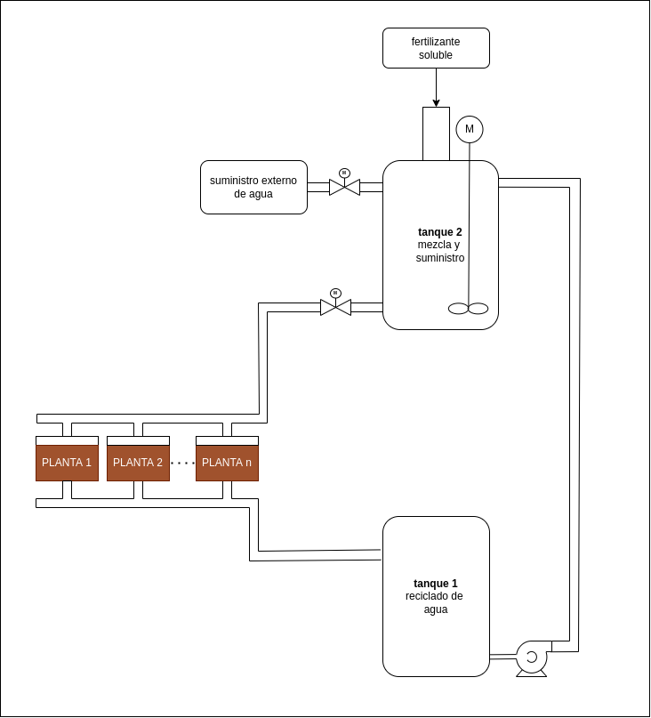
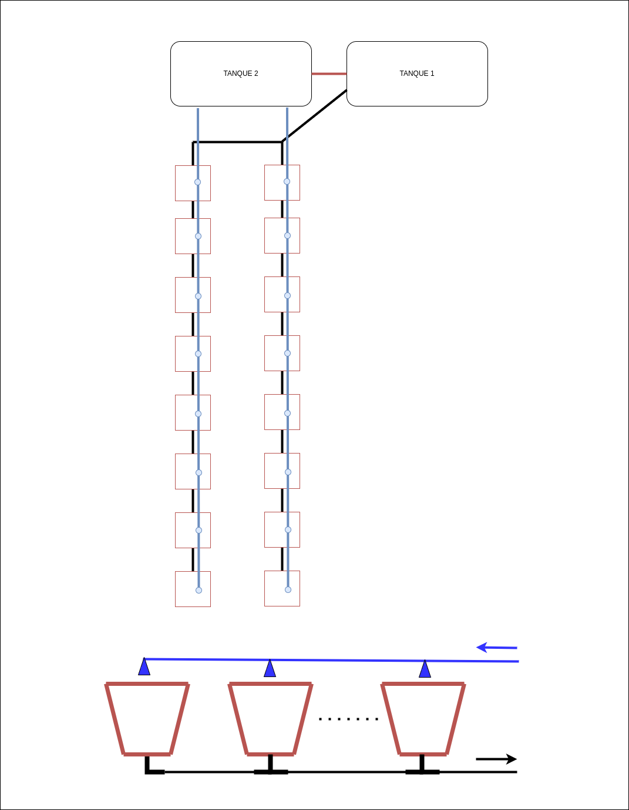

# Invernadero

Este es el repositorio del proyecto para crear un Invernadero inteligente.

## Propuesta: Manejo de Agua

El diseño se vería mejor y más completo si tuviera un sistema de riego automático agregando un sistema de reciclaje de agua. Grandes cantidades de agua se desperdician a la hora de realizar el riego convencional, por lo que un riego por goteo sería nuestra mejor opción.

La idea es una adaptación de lo visto en el siguiente [video](https://www.youtube.com/watch?v=jeU_AZy9j3U), es una manera más eficiente de sembrar en un invernadero.

El trabajo hecho por nuestro compañero nos sirve bastante, pero creo que en lugar de mandar indicaciones de que se debe regar las plantas es mejor que el mismo sistema lo haga automático, que el micro lea el sensor de humedad del sustrato y si está por debajo de un rango pre establecido que de la orden a la electroválvula para empezar el goteo.

A grandes rasgos el sistema para el manejo del agua sería el siguiente:

1. Micro llena el Tanque 2 si no hay suficiente nivel, este llenado se realiza primero con el agua que hay en el Tanque 1 (si es que hay agua) activando la bomba, y si no se ha llenado lo suficiente o no hay agua en el Tanque 1 entonces abre la electroválvula que trae agua del exterior.
2. Una vez que hay agua suficiente en el tanque 1 se apaga la bomba y/o se cierra la electroválvula de llenado.
3. Se procede a abrir la electroválvula de irrigación, el micro estará sondeando los sensores de humedad del sustrato hasta llegar al rango máximo establecido (hacemos histéresis, por debajo del rango se abre, por encima se cierra).
4. El agua residual que no aprovechan las plantas es canalizado hacia el tanque 1.

La idea es que sea modular, por lo que se puede agregar o quitar plantas, lo que se debe agregar son tuberias armables, hay buenas opciones como la siguiente que ya viene con aspersores y es relativamente barato [riego](https://www.tiendamia.cr/p/amz/b0d7mgpp7m/drip-irrigation-system-180-pcs-164ft-garden-irrigation-system-1-4)

La dificultadad de programación es mínima, unos sensores de nivel en los tanques, una bomba para elevar el agua, un motorcillo para mezclas pues en el tanque 1 podemos poner fertilizante soluble en agua para que sea aplicado directamente al irrigar y un par de electroválvulas, el montado no debería ser tan problemático, ya hice unas averiguaciones de como crear los tanques y no es nada del otro mundo.

